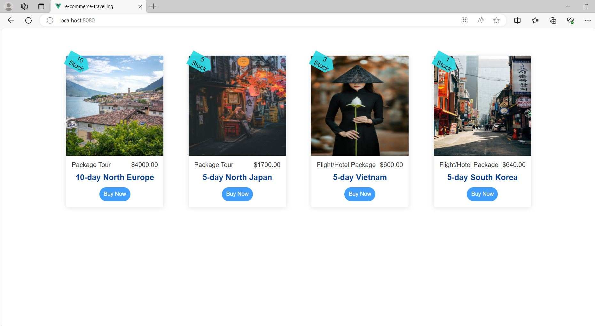

# Purpose
This project is the front-end of an e-commerce website in travelling industry. It roughly demonstrates the project structure and coding techniques that I worked on daily in the company, Ailisi. Due to its demonstration purpose, the project only includes a basic shopping process now.

# Usage

After download the repository, you can install related module through the terminal by doing
```
npm install
```

# Project setup

You can run this application through the terminal by doing the follows:

### Compiles and hot-reloads for development
```
yarn serve
```

### Compiles and minifies for production
```
yarn build
```

### Lints and fixes files
```
yarn lint
```

# URL

If it is run successfully, you can view the UI as the screenshot below shows at: 
```
http://localhost:8080/
```	



# Contact

Althea Chu - [@Althea (Chia-Hsuan) Chu](https://www.linkedin.com/in/althea-chu-24966291/) - aehtla2012@gmail.com

Project Link: [https://github.com/altheachu/e-commerce-travelling.git](https://github.com/altheachu/e-commerce-travelling.git)
